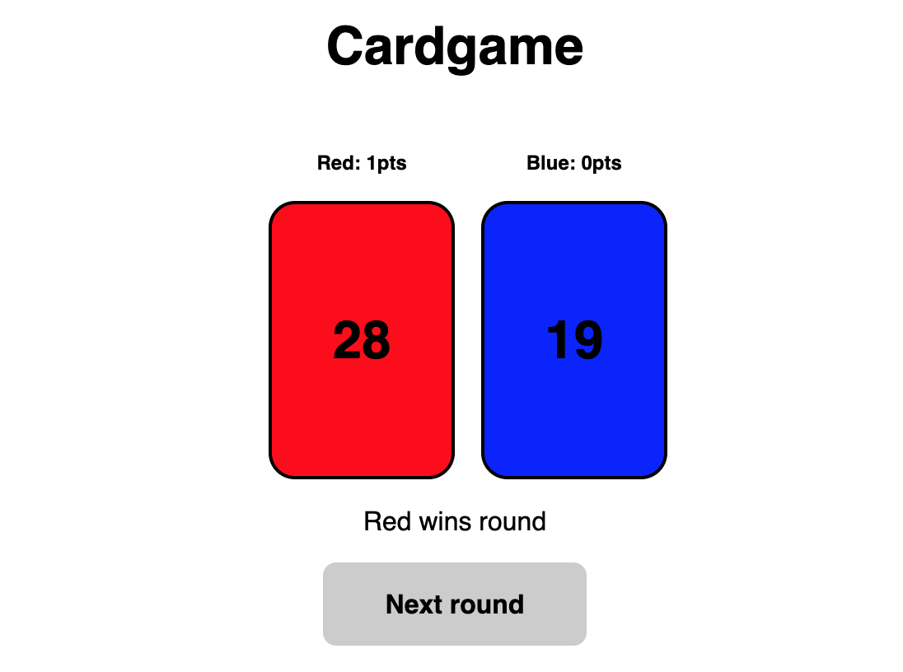

# Cardgame

Simple numeric CardGame implemented in C++/WebAssembly + some Javascript/HTML glue for UI.

The game is meant to be extensible: support a different number of players and different types of cards being played (templating).

## Building

You'll need standard build tools, `make` and `emscripten`. On Mac all this is available via HomeBrew. To build:

`$ make`

This will produce WebAssembly binary (+matching js) and additionally a stand-alone console application `cardgame` which uses same engine and runs a single game on the console.

To start the wasm version just open `index.html` in browser (note: most browsers will prevent loading of local file wasm module due to default CORS configuration. You might need to put the files on a webserver, disable CORS in browser or lunch browser with local file support).

  